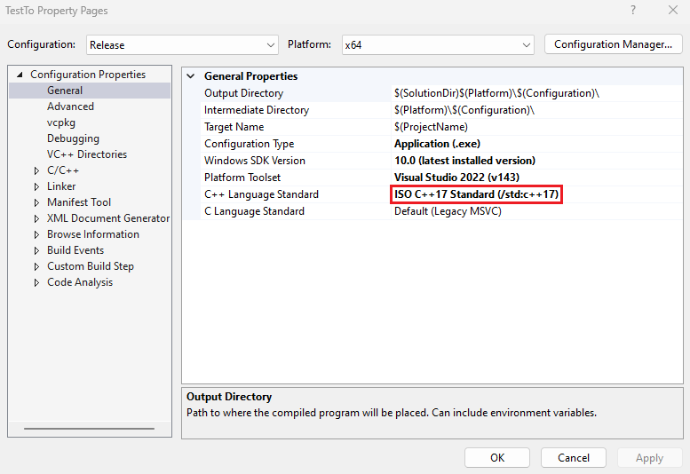

# C++17 Easy String to Number and Vice Versa

In contrast to the template function overloading approach used in Boost `lexical_cast`, this library uses function overloading. All the functions are named `conv()` to reduce cognitive load to focus on the business logic and reduce mistakes.

To limit the library scope, only string to number conversion and vice versa are implemented. All functions are listed at the bottom for your convenience since this is a header only library, so it can be diffcult to search. For brevity, `static` keyword is omitted.

## Problem Space

There are so many different ways of converting string-to-number and number to string in C++ that developers have to google for this information. For example, to convert a string to an integer, we have 5 functions: [atoi](https://en.cppreference.com/w/cpp/string/byte/atoi), [stoi](https://en.cppreference.com/w/cpp/string/basic_string/stol), [strtol](https://en.cppreference.com/w/cpp/string/byte/strtol), [sscanf](https://en.cppreference.com/w/cpp/io/c/fscanf) and [from_chars](https://en.cppreference.com/w/cpp/utility/from_chars). This library makes use of C++17's `from_chars()` for string-to-number conversion and `to_chars()`/`to_string()` for base 10 number to `char` array/`std::string` conversions. In the case of base 8 and 16, it uses `sprintf()/sprintf_s()`.

To use C++17's `from_chars()`, C++ developers are required to remember 4 different ways depending the source string is a `std::string`, `char` pointer, `char` array or `std::string_view` (See below). And `from_chars()` does not support wide string and this library fills up this gap.

```Cpp
int num = 0;
std::string str = "123";
auto ret1 = std::from_chars(str.data(), str.data() + str.length(), num);

num = 0;
const char* cstr = "123";
auto ret2 = std::from_chars(cstr, cstr + strlen(cstr), num);

num = 0;
const char arr[] = "123";
auto ret3 = std::from_chars(std::begin(arr), std::end(arr), num);

num = 0;
std::string_view strv = "123";
auto ret4 = std::from_chars(strv.data(), strv.data() + strv.length(), num);
```


In comparison, the user of `conv::str_to_num()` supplies two parameters and other parameters such as number base and error are optional. For base 16, `conv::str_to_num()` ignores "0x" or "0X" prefixes as a convenience while those prefixes are not recognized in `from_chars()`.

These are the `conv::str_to_num()` equivalent usages of the above `from_chars` examples.

```Cpp
#include "conv.h"

int num = 0;
std::string str = "123";
bool ret1 = conv::str_to_num(str,  num);

num = 0;
const char* cstr = "123";
bool ret2 = conv::str_to_num(cstr, num);

num = 0;
const char arr[] = "123";
bool ret3 = conv::str_to_num(arr,  num); // Note: array decay to a pointer.

num = 0;
std::string_view strv = "123";
bool ret4 = conv::str_to_num(strv, num);
```

## Common Compilation Errors

If you get `to_chars` and `from_chars` undefined errors, make sure you have C++ Language Standard set to C++17.



## Error Handling Rationale from Lessons of lexical_cast()

```Cpp
int num = 0;
std::errc error;
std::string student_id = "abc";
if (!conv::str_to_num(student_id, num, 10, &error))
{
	if (error == std::errc::invalid_argument)
		std::cerr << "error: student_id is non-numeric:" << student_id << std::endl;
}
else
	std::cout << "num:" << num << std::endl;
```

This library's conversion function does not throw exception but returns `false` for failure. Developer can supply an `errc` argument for information. In the special case of number to string, there is no error parameter because no failure is possible except for out of memory so caller can safely assume the error is OOM. For some case, it is enough to know the presence of error, not the cause. Sometimes, error is to be expected for optional field not supplied or mutually-excluded fields, say, in a file configuration settings. It is only possible to obtain contextual information at the call site for meaningful error handling. Boost `lexical_cast()` throws exception with a generic error message of "bad lexical cast: source type value could not be interpreted as target". For instance, I put a bunch of `lexical_cast()` calls under a try-catch block, it is not clear to me which conversion failed during exception. This is the sole reason why such [lexical_cast wrapper](https://www.codeproject.com/Articles/1169069/Boost-Lexical-Cast-Wrapper) exists.

## Future Direction

If this library proves to be popular enough among C++ developers, I intend to do a port to the C++11/14. Maybe a C++23 [std::expected](https://en.cppreference.com/w/cpp/utility/expected) version is in the cards?

# Catalogue of Conversion Functions

This section lists all the conversion function for your convenience since it could be hard to find relevant one in the single header library.

## string-to-float Conversion Functions

```Cpp
// convert string to float
struct conv
{
  // convert std::string_view to float
  //===================================
  bool str_to_float(const string_view& str, float&  num, chars_format fmt = general, errc* ec = nullptr);
  bool str_to_float(const string_view& str, double& num, chars_format fmt = general, errc* ec = nullptr);

  // convert string to float
  //===================================
  bool str_to_float(const string& str, float&  num, chars_format fmt = general, errc* ec = nullptr);
  bool str_to_float(const string& str, double& num, chars_format fmt = general, errc* ec = nullptr);

  // convert const char* to float
  //===================================
  bool str_to_float(const char* str, float&  num, chars_format fmt = general, errc* ec = nullptr);
  bool str_to_float(const char* str, double& num, chars_format fmt = general, errc* ec = nullptr);

  // convert wstring_view to float
  //===================================
  bool str_to_float(const wstring_view& wstr, float&  num, chars_format fmt = general, errc* ec = nullptr);
  bool str_to_float(const wstring_view& wstr, double& num, chars_format fmt = general, errc* ec = nullptr);

  // convert wstring to float
  //===================================
  bool str_to_float(const wstring& wstr, float&  num, chars_format fmt = general, errc* ec = nullptr);
  bool str_to_float(const wstring& wstr, double& num, chars_format fmt = general, errc* ec = nullptr);

  // convert const wchar_t* to float
  //===================================
  bool str_to_float(const wchar_t* wstr, float&  num, chars_format fmt = general, errc* ec = nullptr);
  bool str_to_float(const wchar_t* wstr, double& num, chars_format fmt = general, errc* ec = nullptr);
};
```

## float-to-string Conversion Functions

```Cpp
// convert float to string
struct conv
{
  // convert float to string
  //===================================
  bool float_to_str(float  num, string& str, chars_format fmt = general);
  bool float_to_str(double num, string& str, chars_format fmt = general);

  bool float_to_str(float  num, string& str, int precision);
  bool float_to_str(double num, string& str, int precision);

  // convert float to char*
  //===================================
  bool float_to_str(float  num, char* str, size_t len, chars_format fmt = general);
  bool float_to_str(double num, char* str, size_t len, chars_format fmt = general);

  // convert float to wstring
  //===================================
  bool float_to_str(float  num, wstring& str, chars_format fmt = general);
  bool float_to_str(double num, wstring& str, chars_format fmt = general);

  bool float_to_str(float  num, wstring& str, int precision);
  bool float_to_str(double num, wstring& str, int precision);

  // convert float to wchar_t*
  //===================================
  bool float_to_str(float  num, wchar_t* wstr, size_t len, chars_format fmt = general);
  bool float_to_str(double num, wchar_t* wstr, size_t len, chars_format fmt = general);
};
```

## string-to-number Conversion Functions

```Cpp
// convert string to number
struct conv
{
  // convert std::string_view to number
  //===================================
  bool str_to_num(const string_view& str, int16_t&  num, int base = 10, errc* ec = nullptr);
  bool str_to_num(const string_view& str, uint16_t& num, int base = 10, errc* ec = nullptr);
  bool str_to_num(const string_view& str, int32_t&  num, int base = 10, errc* ec = nullptr);
  bool str_to_num(const string_view& str, uint32_t& num, int base = 10, errc* ec = nullptr);
  bool str_to_num(const string_view& str, int64_t&  num, int base = 10, errc* ec = nullptr);
  bool str_to_num(const string_view& str, uint64_t& num, int base = 10, errc* ec = nullptr);

  // convert string to number
  //===================================
  bool str_to_num(const string& str, int16_t&  num, int base = 10, errc* ec = nullptr);
  bool str_to_num(const string& str, uint16_t& num, int base = 10, errc* ec = nullptr);
  bool str_to_num(const string& str, int32_t&  num, int base = 10, errc* ec = nullptr);
  bool str_to_num(const string& str, uint32_t& num, int base = 10, errc* ec = nullptr);
  bool str_to_num(const string& str, int64_t&  num, int base = 10, errc* ec = nullptr);
  bool str_to_num(const string& str, uint64_t& num, int base = 10, errc* ec = nullptr);

  // convert const char* to number
  //===================================
  bool str_to_num(const char* str, int16_t&  num, int base = 10, errc* ec = nullptr);
  bool str_to_num(const char* str, uint16_t& num, int base = 10, errc* ec = nullptr);
  bool str_to_num(const char* str, int32_t&  num, int base = 10, errc* ec = nullptr);
  bool str_to_num(const char* str, uint32_t& num, int base = 10, errc* ec = nullptr);
  bool str_to_num(const char* str, int64_t&  num, int base = 10, errc* ec = nullptr);
  bool str_to_num(const char* str, uint64_t& num, int base = 10, errc* ec = nullptr);

  // convert wstring_view to number
  //===================================
  bool str_to_num(const wstring_view& wstr, int16_t&  num, int base = 10, errc* ec = nullptr);
  bool str_to_num(const wstring_view& wstr, uint16_t& num, int base = 10, errc* ec = nullptr);
  bool str_to_num(const wstring_view& wstr, int32_t&  num, int base = 10, errc* ec = nullptr);
  bool str_to_num(const wstring_view& wstr, uint32_t& num, int base = 10, errc* ec = nullptr);
  bool str_to_num(const wstring_view& wstr, int64_t&  num, int base = 10, errc* ec = nullptr);
  bool str_to_num(const wstring_view& wstr, uint64_t& num, int base = 10, errc* ec = nullptr);

  // convert wstring to number
  //===================================
  bool str_to_num(const wstring& wstr, int16_t&  num, int base = 10, errc* ec = nullptr);
  bool str_to_num(const wstring& wstr, uint16_t& num, int base = 10, errc* ec = nullptr);
  bool str_to_num(const wstring& wstr, int32_t&  num, int base = 10, errc* ec = nullptr);
  bool str_to_num(const wstring& wstr, uint32_t& num, int base = 10, errc* ec = nullptr);
  bool str_to_num(const wstring& wstr, int64_t&  num, int base = 10, errc* ec = nullptr);
  bool str_to_num(const wstring& wstr, uint64_t& num, int base = 10, errc* ec = nullptr);

  // convert const wchar_t* to number
  //===================================
  bool str_to_num(const wchar_t* wstr, int16_t&  num, int base = 10, errc* ec = nullptr);
  bool str_to_num(const wchar_t* wstr, uint16_t& num, int base = 10, errc* ec = nullptr);
  bool str_to_num(const wchar_t* wstr, int32_t&  num, int base = 10, errc* ec = nullptr);
  bool str_to_num(const wchar_t* wstr, uint32_t& num, int base = 10, errc* ec = nullptr);
  bool str_to_num(const wchar_t* wstr, int64_t&  num, int base = 10, errc* ec = nullptr);
  bool str_to_num(const wchar_t* wstr, uint64_t& num, int base = 10, errc* ec = nullptr);
};
```

## number-to-string Conversion Functions

```Cpp
// convert number to string
struct conv
{
  // convert number to string
  //===================================
  bool num_to_str(int16_t  num, string& str, int base = 10);
  bool num_to_str(uint16_t num, string& str, int base = 10);
  bool num_to_str(int32_t  num, string& str, int base = 10);
  bool num_to_str(uint32_t num, string& str, int base = 10);
  bool num_to_str(int64_t  num, string& str, int base = 10);
  bool num_to_str(uint64_t num, string& str, int base = 10);

  // convert number to char*
  //===================================
  bool num_to_str(int16_t  num, char* str, size_t len, int base = 10);
  bool num_to_str(uint16_t num, char* str, size_t len, int base = 10);
  bool num_to_str(int32_t  num, char* str, size_t len, int base = 10);
  bool num_to_str(uint32_t num, char* str, size_t len, int base = 10);
  bool num_to_str(int64_t  num, char* str, size_t len, int base = 10);
  bool num_to_str(uint64_t num, char* str, size_t len, int base = 10);

  // convert number to wstring
  //===================================
  bool num_to_str(int16_t  num, wstring& str, int base = 10);
  bool num_to_str(uint16_t num, wstring& str, int base = 10);
  bool num_to_str(int32_t  num, wstring& str, int base = 10);
  bool num_to_str(uint32_t num, wstring& str, int base = 10);
  bool num_to_str(int64_t  num, wstring& str, int base = 10);
  bool num_to_str(uint64_t num, wstring& str, int base = 10);

  // convert number to wchar_t*
  //===================================
  bool num_to_str(int16_t  num, wchar_t* wstr, size_t len, int base = 10);
  bool num_to_str(uint16_t num, wchar_t* wstr, size_t len, int base = 10);
  bool num_to_str(int32_t  num, wchar_t* wstr, size_t len, int base = 10);
  bool num_to_str(uint32_t num, wchar_t* wstr, size_t len, int base = 10);
  bool num_to_str(int64_t  num, wchar_t* wstr, size_t len, int base = 10);
  bool num_to_str(uint64_t num, wchar_t* wstr, size_t len, int base = 10);
};
```

## string-to-string Conversion Functions

You can ignore the naive wide string to narrow string conversion and vice versa. They are used internally by above classes.

```Cpp
// convert string to string
struct conv
{
  // convert wstring to string
  //===================================
  bool wstr_to_str(const wstring_view& view, string& str);
  bool wstr_to_str(const wstring& wstr, string& str);
  bool wstr_to_str(const wchar_t* wstr, string& str);

  // convert string to wstring
  //===================================
  bool str_to_wstr(const string_view& view, wstring& wstr);
  bool str_to_wstr(const string& str, wstring& wstr);
  bool str_to_wstr(const char* str,   wstring& wstr);
};
```
